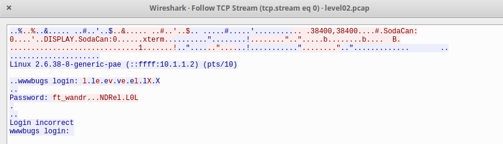

Install Wireshark tool
```shell
sudo apt install wireshark
```
Copy file from SnowCrash to local machine:
```shell
jheat@jheat:~/SnowCrash/level02/Resources$ scp -P 4242 level00@192.168.56.101:./level02.pcap .
```
Open file level02.pcap in wireshark:
```shell
wireshark level02.pcap
```
Select Analyze and Follow TCP Stream
Select in show and save data as ASCII

Password: ft_wandr...NDRel.L0L
The . are ASCII code 7f which means del
Correct password after deleting required symbols is
ft_waNDReL0L